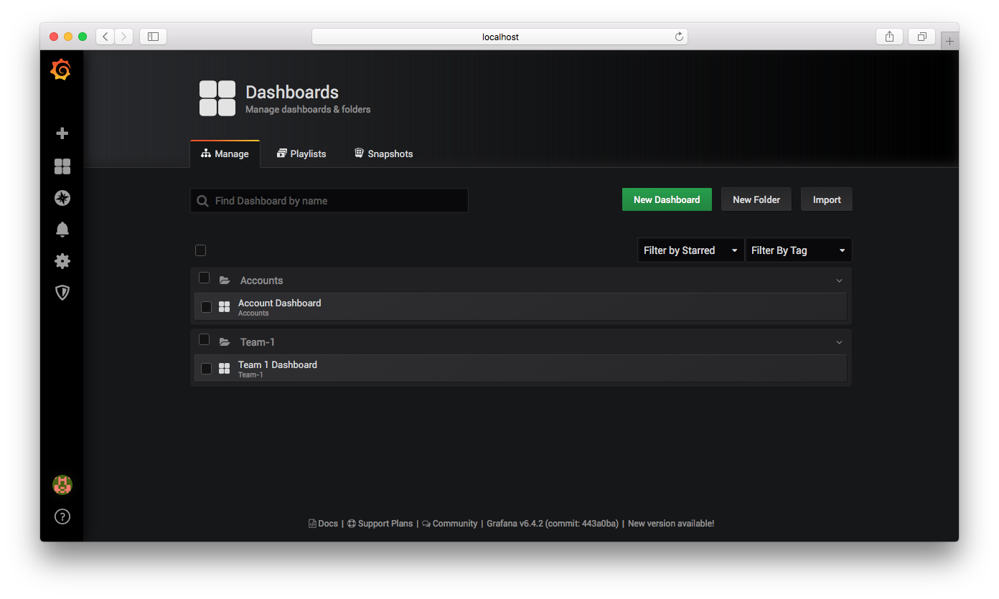

= Grafana Sidecar Sample

Installs the web dashboarding system https://grafana.com/[Grafana] with sidecar support. Additionally add dashboards from configmaps to specific folders in grafana.

Tested with Chart stable/grafana --Version 

== Create the PersistentVolume

`kubectl apply -f persistent-volumes/pv-pvc-grafana.yml`

== Installing the Chart

`helm install --name grafana stable/grafana -f grafana-values.yaml`

== Create the ConfigMaps

`kubectl apply -f configmaps/account-dashboard-cm.yaml`

`kubectl apply -f configmaps/team-1-dashboard-cm.yaml`

If you now go to the Grafana instance, the dashboards should be visible inside the folders. (Maybe you need a `port-forward`)

`kubectl port-forward <pod-name> 3000`



== Add another folder

To add more folders you have to add another `dashboardProviders` to the grafana-values Yaml.

```
dashboardProviders:
  dashboardproviders.yaml:
    apiVersion: 1
    providers:
    - name: 'new-team'
      orgId: 1
      folder: 'New-Team'
      type: file
      disableDeletion: true
      editable: false
      options:
        path: /tmp/dashboards/new-team
```

Additionally you have to make sure that the dashboards that are added with the ConfigMap have the following `label` and `annotation` set:

```
metadata:
  labels:
    grafana_dashboard: "1"
  annotations:
    k8s-sidecar-target-directory: "/tmp/dashboards/new-team"
```

In the annotation `k8s-sidecar-target-directory`, you specify the folder (the folder must already present in the `dashboardProviders`).